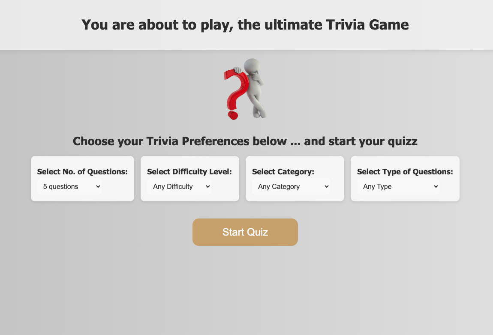
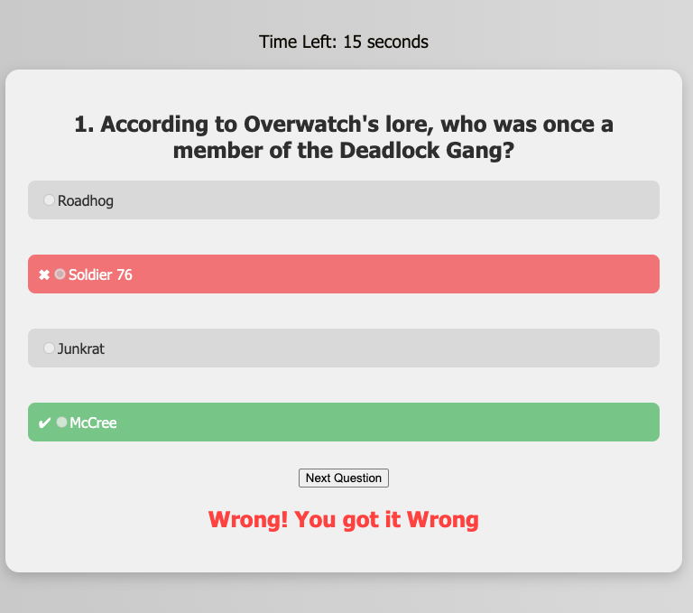
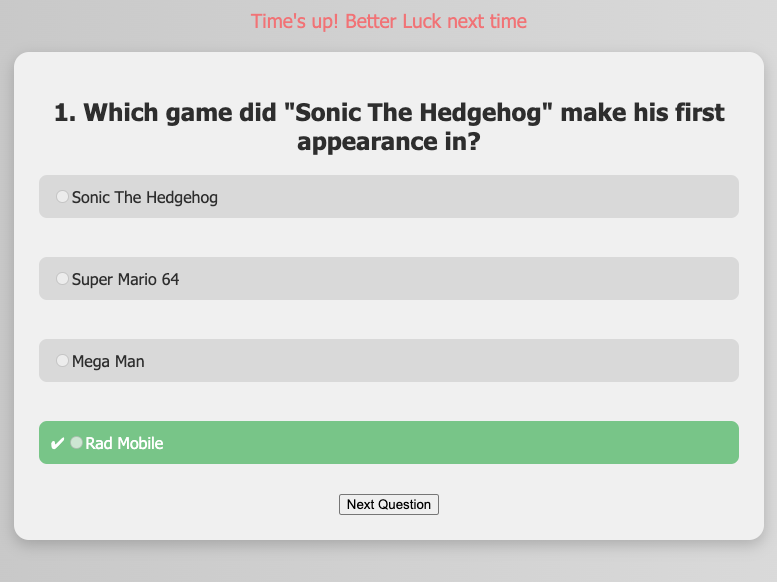
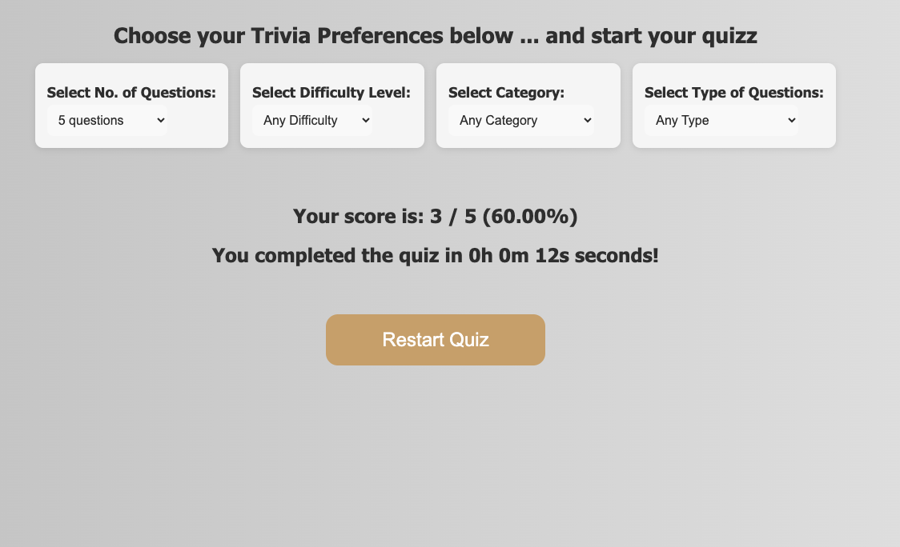

# Caroline-Ininga-trivia-project

## 1.  Phase 1 Final Project : Trivia Project Summary

The Trivia project was my final project in Moringa SDF_PT10 in Phase 1. It was an individual project where 5 problem statements were provided for us and each student had to pick one problem statement to work on. The time given to complete the project was about a week and a half from 10th - 21st April 2025.

## 2. Languages/Technologies used
 - Html
 - CSS
 - Javascript
 - Github

 ## 3. Main/Key Features

This is a trivia interactive quizz web game app with a  number of either multiple choice or true/false questions. 

Key features include;

1. The user can select the category, difficulty of questions, number of questions and type of questions to be quizzed at before starting the quizz.
2. The user deals with one question at a time. A timer countdown is displayed and user has 15 seconds to answer each question.
3. The user is notified of the correct answer if;
  -  They give a wrong answer
  -  Timer runs out before they answer the question
4. The user uses the next question buttton to naviagate from current question to the next question
5. The user sess a finish button at the end of the quizz which upon clicking, they get to see thier total score for the quizz and the total time taken to answer all the questions.
6. An option to restart the quizz with the desired category options or different category options. 
 
   
## 4. How to run the app on the web

This app is hosted on github pages. 


[Click here](https://moringa-sdf-pt10.github.io/Caroline-Ininga-trivia-project/) to play trivia game on the web


## 5. How to run this repository on your local machine
   1. Clone the repository 

Open your terminal, and navigate to the directory where you wish to clone the repo run the following command;

   ```
   git clone  git@github.com:Moringa-SDF-PT10/Caroline-Ininga-trivia-project.git
   ```
   2. After the repo is done cloning to your local machine, navigate to the cloned repo in the terminal by running the following command;

   ```
   cd Caroline-Ininga-trivia-project/
   ```
   3. Confirm the contents of the folder by running the ls command

   ```
   ls
   ```
  4. You should see the following files; index.html, script.js, style.css and a folder called assets containing all the images I used for the project.

  5.  While still on your terminal, open index.html to view the app on your local machine default browser. 
  
  Run the command below:

   ```
   open index.html
   ```
  

## 6. Screenshots





# 7. Contacts
  Checkout my github profile: [link]: https://github.com/jkininga

  Checkout my linkedn profile: [link]: https://www.linkedin.com/in/carolineininga/

  Check out my website: [link]: https://carolineininga.com/


# 8. License

This project is free to use and not restricted by a license